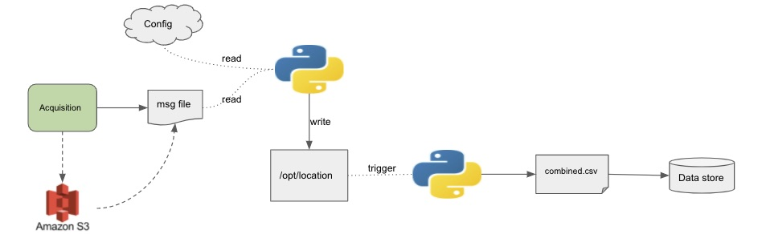

# manulife-test

Engineering test for manulife

## Details

Means of generate the combine file to be stored downstream for end users. The details below are all an abstraction of what the application/process can be. The parts I will try to implement will be the reading of the config and message file and the piece that writes the combined file.

A few things to note due to time constraint (really apologize having two kids and a busy work schedule does this, hope you see this as a good thing as I like to dedicate my time to the product and firm I am working for/with):

* Logging is missing
* Checking whether the file exists in the `utils.py` is included
* Reading of the csv will take consideration of the content type to apply the appropriate means of reading the file (I used csv package but you can use pandas too)
* Missing a setup.py (production code will have this especially when you are using a CI/CD tool)

## Design



### Design Details

#### Acquisition

The method of which the document was acquired. In a message schema this will be constructed as such:

```json
{
    "acquisition_type": {
        "enum": ["EMAIL", "SFTP", "CRAWLER", "MANUAL"]
    }
}
```

#### Raw File

Upon acquisition the raw file is written directly to an S3 bucket. This will be the mechanism of storing the raw files which can be pulled if a backfill is needed.

#### Message schema

In the world of event driven workflow, the acquisition step will produce a message which in turn is consumed by a service. Message schema will look something like this:

```json
{
    "acquisition": {
        "record:acquisitionrecord": {
            "type": "object",
            "required": ["file_name"],
            "additionalProperties": false,
            "properties": {
                "file_name": {"type": "string"},
                "acquisition_type": {
                    "enum": ["EMAIL", "SFTP", "CRAWLER", "MANUAL"]
                },
                "acquisition_datetime": {"type": "datetime"},
                "content_type": {"type": "string"},
                "bucket": {"type": "string"}
            }
        }
    }
}
```

#### Configurations

Ideally there will be a configuration storage which will be the main driver of the application/process. The idea of a configuration store can even be extrapolated within a web ui allowing product owners to configure what they will like to capture or how the want the application/process to flow.

Configuration stores also make production code easier to deploy and any major changes in the configuration won't cause any redeployment.

The schema for the configuration will be something like this:

```json
{
    "configuration_store": {
        "record:processconfig": {
            "type": "object",
            "required": ["file_regex"],
            "properties": {
                "data": {
                    "type": "array",
                    "items": [
                        {
                            "file_regex": {"type": "string"}
                        }
                    ]
                },
                "put": {"type": "string"}
            }
        }
    }
}
```

#### Read config & message

Python script that takes the config and message file and validates that the data within the message file is something the application is targetting.

If it passes validation, it takes the file and puts it to the file directory that will trigger another script.

#### Put file location

Directory the file is dropped. In the diagram it says `/opt/location` thats just arbitrary.

#### Construct combine file

Python script that implements the writting of the combined.csv file.

#### Store file

Hypothetically this file will be written to a data store rather than just keeping it in the directory.

## How to run code

* clone repository
`git clone https://github.com/kwadwo-asante22/manulife-test.git`
* create a virtual environment
`python3.7 -m venv venv`
* install the libraries needed
`pip install -r requirements.txt`
* if a new file is being used change `sample message` within `message.py` to the
file preferred (so example change it from `NA Prod.csv` to `NA Preview.csv`)
* Add the right regex string for the file to the `config_store` in the `config.py` file
* drop the file in this directory `store/test_files/Engineering_Test_Files`
* Save all the files that were modified
* In a terminal window type in the command `python main.py`
* Check the `store/destination` directory for the newly generated `Combined.csv`

Can fill in the rest during our discussion, thank you.
